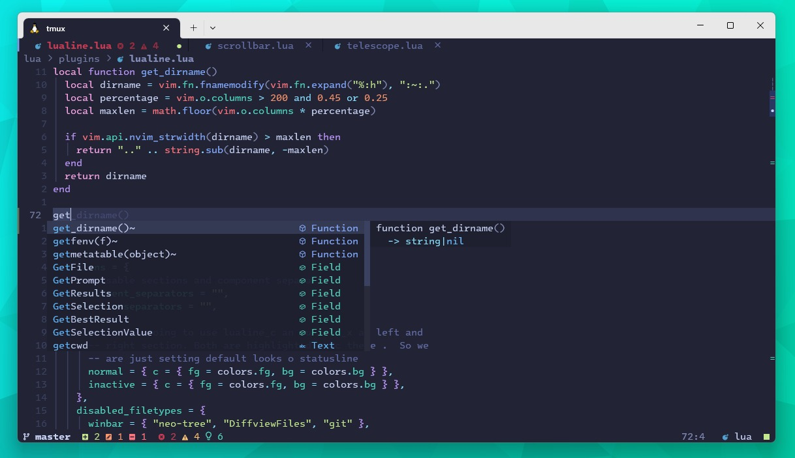
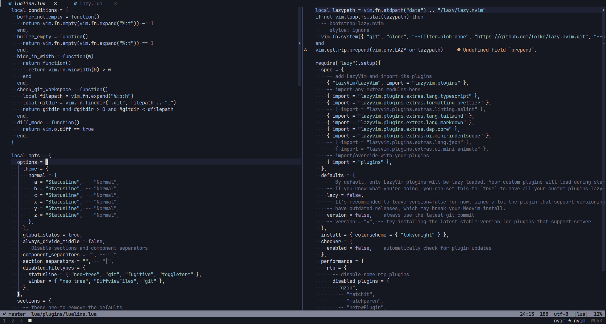

# My Personal Neovim configuration

For my old neovim configuration, checkout my [dotfiles](https://github.com/pirey/dotfiles/tree/master/archlinux/home/.config/nvim)

## Screenshots

### Tokyonight

```lua
{
  font = "Intel Mono",
  terminal = "Windows Terminal"
}
```



### Iceberg

```lua
{
  font = "JetBrains Mono",
  terminal = "Alacritty"
}
```


